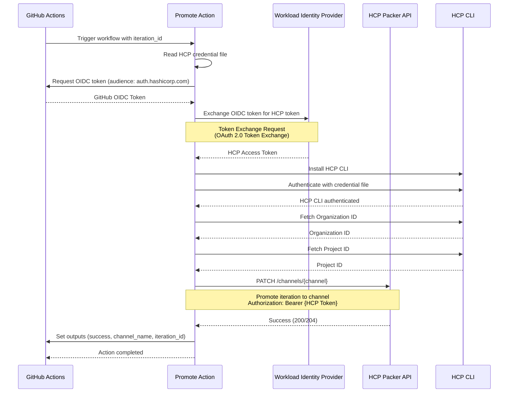
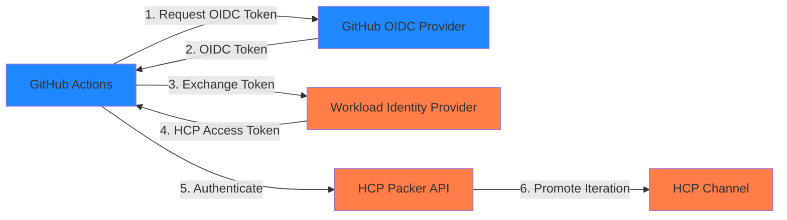

# HCP Packer Promote to Channel Action

[](https://github.com/Timotej979/hcp-packer-promote-to-channel/releases)
[](https://github.com/marketplace/actions/hcp-packer-promote-to-channel)
[](LICENSE)
[](https://www.hashicorp.com/products/packer)

🚀 GitHub Action to promote HCP Packer image iterations to distribution channels using OIDC workload identity federation | 🔐 Secure authentication without storing credentials | 📦 Perfect for golden image pipelines

## Overview

This GitHub Action automates the promotion of HCP Packer image iterations to distribution channels. It uses OIDC workload identity federation to securely authenticate with HCP without requiring long-lived credentials. The action fetches the HCP JWT token for authentication using OIDC through Workload Identity Federation/Provider schema and promotes the iteration of your Packer image through the iteration ID.

## How It Works

The following diagram illustrates the authentication and promotion flow:



### Authentication Flow



## Features

- ✅ **OIDC Support**: Uses workload identity federation for secure authentication without storing credentials
- ✅ **Channel Promotion**: Promote specific image iterations to HCP Packer channels via the HCP Packer API
- ✅ **CI/CD Ready**: Seamlessly integrates into GitHub Actions workflows
- ✅ **Golden Image Workflows**: Perfect for automating golden image promotion pipelines
- ✅ **Automatic Organization/Project Detection**: Automatically fetches organization and project IDs from HCP CLI

## Prerequisites

- An HCP Packer organization and bucket configured
- OIDC workload identity federation configured in your HCP organization
- An HCP credential file containing the workload identity provider configuration
- Appropriate permissions to promote iterations to channels in HCP Packer
- GitHub Actions workflow with `id-token: write` permission for OIDC token exchange

> **Note on WIF/WIP Authentication**: This action uses OIDC workload identity federation (WIF/WIP) for authentication, which is the recommended secure method for GitHub Actions. If you're experiencing issues with Packer builds using WIF/WIP authentication, see [hashicorp/packer#13454](https://github.com/hashicorp/packer/issues/13454) for known issues and workarounds. This action specifically handles channel promotion (not image building) and works correctly with WIF/WIP authentication.

## Usage

### Basic Example

```yaml
name: Promote to Channel

on:
  workflow_dispatch:
    inputs:
      iteration_id:
        description: 'HCP Packer iteration ID to promote'
        required: true
      channel:
        description: 'Channel name to promote to'
        required: true

jobs:
  promote:
    runs-on: ubuntu-latest
    permissions:
      id-token: write
      contents: read
    steps:
      - name: Generate HCP credential file
        run: |
          # Create HCP credential file with workload identity provider config
          mkdir -p ~/.config/hcp
          cat > ~/.config/hcp/credentials.json <<EOF
          {
            "workload": {
              "url": "https://your-wip-endpoint.com/token",
              "headers": {}
            }
          }
          EOF
      
      - name: Promote iteration to channel
        uses: Timotej979/hcp-packer-promote-to-channel-action@v1
        with:
          hcp_cred_file: ~/.config/hcp/credentials.json
          hcp_cli_version: 'latest'
          iteration_id: ${{ inputs.iteration_id }}
          channel: ${{ inputs.channel }}
          bucket_name: 'my-bucket'
```

### With Custom HCP CLI Version

```yaml
name: Promote to Channel

on:
  push:
    branches:
      - main

jobs:
  promote:
    runs-on: ubuntu-latest
    permissions:
      id-token: write
      contents: read
    steps:
      - name: Setup HCP credential file
        run: |
          mkdir -p ~/.config/hcp
          echo '${{ secrets.HCP_CRED_FILE }}' > ~/.config/hcp/credentials.json
      
      - name: Promote iteration to channel
        uses: Timotej979/hcp-packer-promote-to-channel-action@v1
        with:
          hcp_cred_file: ~/.config/hcp/credentials.json
          hcp_cli_version: '1.14.2'
          iteration_id: ${{ github.sha }}
          channel: 'production'
          bucket_name: 'golden-images'
```

## Inputs

| Input | Description | Required | Default |
|-------|-------------|----------|---------|
| `hcp_cred_file` | Path to HCP credential file containing workload identity provider configuration | Yes | - |
| `hcp_cli_version` | HCP CLI version to install (e.g., "latest" or "1.14.0") | Yes | `latest` |
| `iteration_id` | The HCP Packer iteration ID to promote | Yes | - |
| `channel` | The name of the channel to promote to | Yes | - |
| `bucket_name` | The name of the HCP Packer bucket | Yes | - |

## Outputs

| Output | Description |
|--------|-------------|
| `success` | Whether the promotion was successful (`true` or `false`) |
| `channel_name` | The name of the channel the iteration was promoted to |
| `iteration_id` | The iteration ID that was promoted |

## HCP Credential File Format

The HCP credential file must be a JSON file containing the workload identity provider configuration:

```json
{
  "workload": {
    "url": "https://your-workload-identity-provider-endpoint.com/token",
    "headers": {
      "Authorization": "Bearer your-token",
      "Custom-Header": "value"
    }
  }
}
```

The `url` field is required and must be an HTTPS endpoint. The `headers` field is optional and can contain any custom headers required by your workload identity provider.

## Authentication

This action uses **OIDC Workload Identity Federation** for authentication:

1. The action requests a GitHub OIDC token with audience `https://auth.hashicorp.com`
2. The GitHub OIDC token is exchanged for an HCP access token via your workload identity provider
3. The HCP access token is used to authenticate with the HCP Packer API

### Required Workflow Permissions

Your workflow must have the `id-token: write` permission:

```yaml
permissions:
  id-token: write
  contents: read
```

## Examples

> 💡 **More Examples**: Check out the [examples directory](examples/) for additional workflow patterns including multi-channel promotion, conditional promotion, and complete build-and-promote pipelines.

### Promote After Successful Build

```yaml
name: Build and Promote

on:
  push:
    branches:
      - main

jobs:
  build:
    runs-on: ubuntu-latest
    permissions:
      id-token: write
      contents: read
    steps:
      - uses: actions/checkout@v4
      
      - name: Build image
        run: |
          # Your build steps here
          packer build template.json
      
      - name: Setup HCP credential file
        run: |
          mkdir -p ~/.config/hcp
          echo '${{ secrets.HCP_CRED_FILE }}' > ~/.config/hcp/credentials.json
      
      - name: Promote to staging
        uses: Timotej979/hcp-packer-promote-to-channel-action@v1
        with:
          hcp_cred_file: ~/.config/hcp/credentials.json
          hcp_cli_version: 'latest'
          iteration_id: ${{ github.sha }}
          channel: 'staging'
          bucket_name: 'my-images'
```

### Manual Promotion Workflow

```yaml
name: Manual Channel Promotion

on:
  workflow_dispatch:
    inputs:
      iteration_id:
        description: 'Iteration ID to promote'
        required: true
      channel:
        description: 'Target channel'
        required: true
        type: choice
        options:
          - staging
          - production

jobs:
  promote:
    runs-on: ubuntu-latest
    permissions:
      id-token: write
      contents: read
    steps:
      - name: Setup HCP credential file
        run: |
          mkdir -p ~/.config/hcp
          echo '${{ secrets.HCP_CRED_FILE }}' > ~/.config/hcp/credentials.json
      
      - name: Promote to ${{ inputs.channel }}
        uses: Timotej979/hcp-packer-promote-to-channel-action@v1
        with:
          hcp_cred_file: ~/.config/hcp/credentials.json
          hcp_cli_version: 'latest'
          iteration_id: ${{ inputs.iteration_id }}
          channel: ${{ inputs.channel }}
          bucket_name: 'golden-images'
```

### Using Outputs

```yaml
- name: Promote iteration
  id: promote
  uses: Timotej979/hcp-packer-promote-to-channel-action@v1
  with:
    hcp_cred_file: ~/.config/hcp/credentials.json
    hcp_cli_version: 'latest'
    iteration_id: 'iter-12345'
    channel: 'production'
    bucket_name: 'my-bucket'

- name: Check promotion result
  run: |
    if [ "${{ steps.promote.outputs.success }}" == "true" ]; then
      echo "Successfully promoted ${{ steps.promote.outputs.iteration_id }} to ${{ steps.promote.outputs.channel_name }}"
    fi
```

## Troubleshooting

### Common Issues

1. **Packer Build Issues with WIF/WIP Authentication**
   - This action is for **promoting** images to channels, not building them
   - If you're experiencing issues building Packer images with WIF/WIP authentication, see the [known issue in the Packer repository](https://github.com/hashicorp/packer/issues/13454)
   - The issue describes problems with Packer builds requiring `HCP_CLIENT_ID` and `HCP_CLIENT_SECRET` environment variables even when using WIF/WIP
   - **This action works correctly** with WIF/WIP for channel promotion operations
   - For building images, ensure you have Packer version 1.14.2 or higher (Check the [HCP Packer CLI release notes](https://github.com/hashicorp/packer/releases) for the latest version)

2. **Failed to obtain GitHub OIDC token**
   - Ensure your workflow has `id-token: write` permission
   - Check that the workflow is running in a context that supports OIDC (not in forks by default)

3. **Token exchange failed**
   - Verify your workload identity provider endpoint URL is correct and accessible
   - Check that the URL uses HTTPS protocol
   - Ensure any custom headers in the credential file are correct

4. **Failed to assign iteration to channel**
   - Verify the service principal has the 'contributor' role for Packer operations
   - Check that the iteration ID and channel name are correct
   - Ensure the bucket name matches your HCP Packer bucket

5. **Failed to extract organization/project ID**
   - The action automatically fetches these from HCP CLI
   - Ensure your HCP credential file is valid and the workload identity federation is properly configured

### Related Issues

- **Packer Build Authentication**: If you're having issues building Packer images (not promoting) with WIF/WIP, refer to [hashicorp/packer#13454](https://github.com/hashicorp/packer/issues/13454) for details on the known issue with Packer builds requiring static credentials even when using workload identity federation.

## References

The following resources were instrumental in developing this action and provide valuable context for understanding HCP Packer channel promotion and the HCP Packer API:

- **[Golden Image Pipelines With HCP Packer](https://devdosvid.blog/2022/06/26/golden-image-pipelines-with-hcp-packer/)** - Comprehensive guide explaining HCP Packer concepts, including image buckets, iterations, channels, and the PATCH API method for channel promotion. This blog post provided the foundation for implementing the channel promotion API call used in this action.

- **[HCP Packer Documentation](https://developer.hashicorp.com/packer/docs/hcp)** - Official HashiCorp documentation for HCP Packer, covering registry concepts, API endpoints, and integration patterns. Essential reference for understanding the HCP Packer architecture and available operations.

- **[GitHub Actions OIDC Documentation](https://docs.github.com/en/actions/deployment/security-hardening-your-deployments/about-security-hardening-with-openid-connect)** - Official guide on using OpenID Connect (OIDC) for secure authentication in GitHub Actions workflows. This documentation explains how to configure workload identity federation, which this action uses for secure authentication without storing long-lived credentials.

- **[Packer WIF/WIP Issue](https://github.com/hashicorp/packer/issues/13454)** - Closed GitHub issue I opened discussing known limitations with Packer builds using workload identity federation/workload identity provider (WIF/WIP) authentication. This action specifically handles channel promotion (not image building) and works correctly with WIF/WIP, addressing a gap in the Packer ecosystem.

## Contributing

Contributions are welcome! Please feel free to submit a Pull Request or open an issue on GitHub.

## License

This project is licensed under the MIT License - see the [LICENSE](LICENSE) file for details.

## Support

For issues, questions, or contributions, please open an issue on GitHub.
